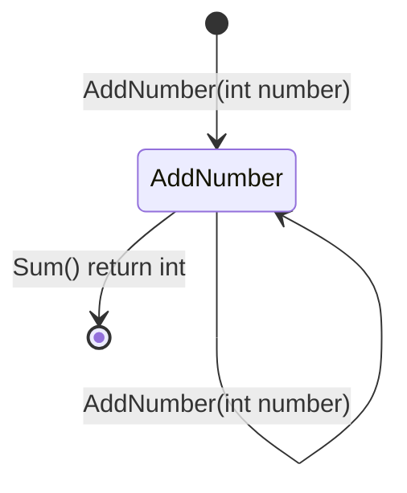
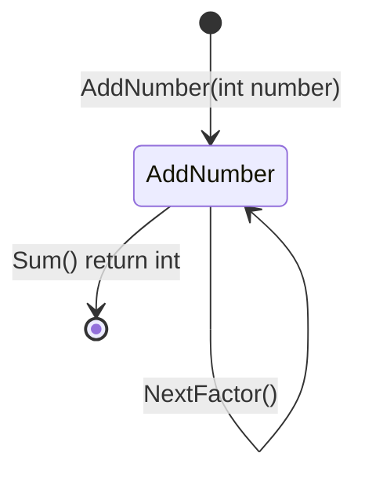
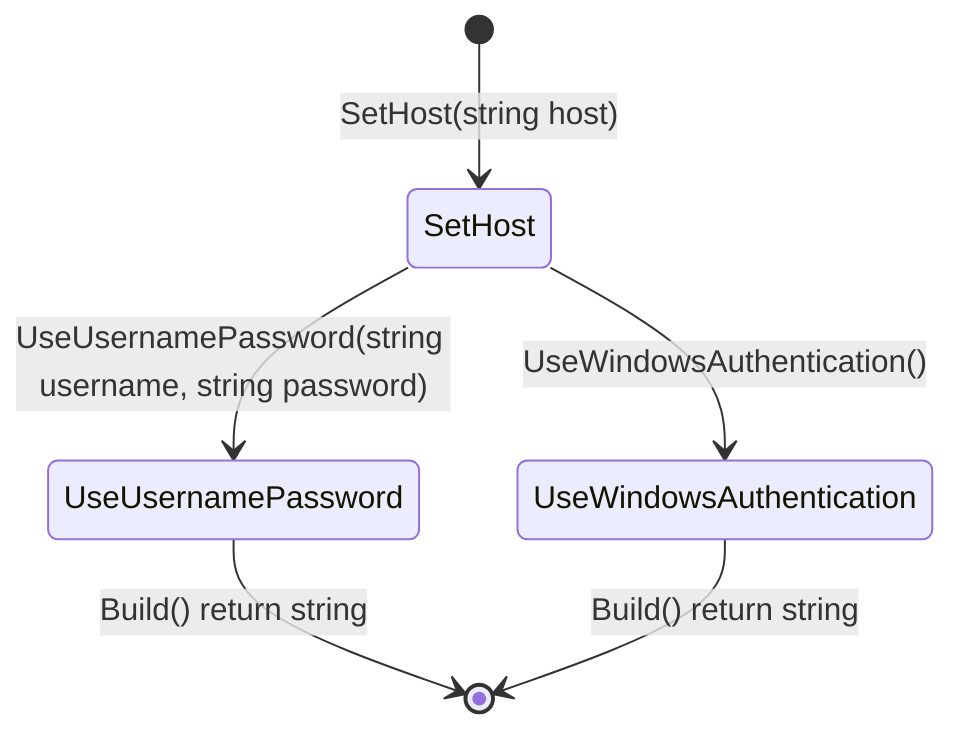
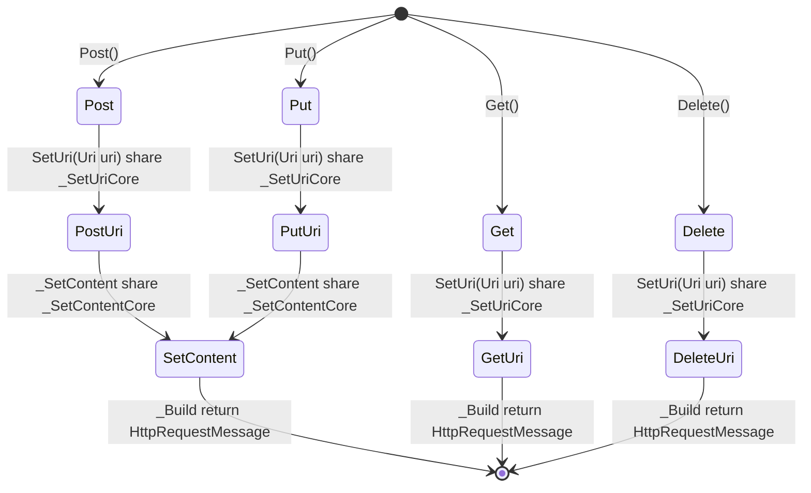
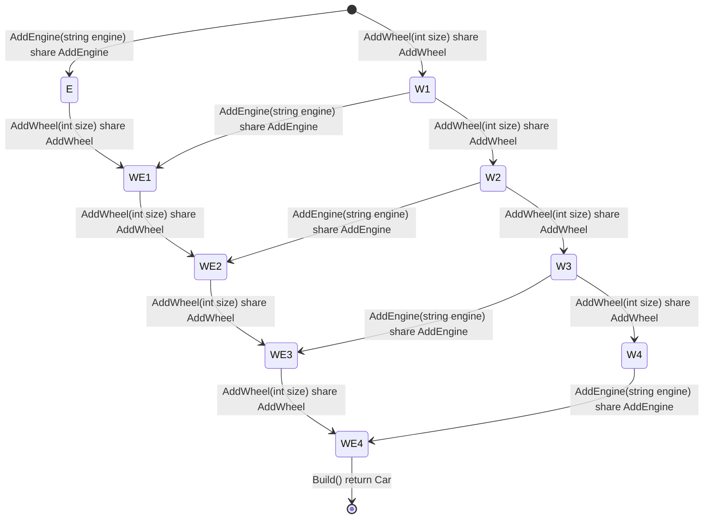

在 Newbe.ObjectVistor 0.3 版本中我们非常兴奋的引入了一个紧张刺激的新特性：使用状态图来生成任意给定的 FluentAPI 设计。

<!-- more -->

## 开篇摘要

在非常多优秀的框架中都存在一部分 FluentAPI 的设计。这种 API 设计更加符合人类自言语言描述。使得代码更加具备可读性。

在 Newbe.ObjectVistor 0.3 版本中，我们设计引入了一种使用状态图来自动生成 FluentAPI 代码的机制。极大了简化了 FluentAPI 实现所需要的脑力劳动。

本篇我们将通过一些示例，来了解一下当前版本中该特性的主要效果。

## 整数累加 FluentAPI

假如，我们现在需要实现下面这样效果的一个 API：

```cs
[Test]
public void SumList()
{
    var sumBuilder = new SumBuilder(new List<int>());
    var re = sumBuilder
        .AddNumber(1)
        .AddNumber(2)
        .AddNumber(3)
        .Sum();
    re.Should().Be(6);
}
```

这个 API 使用 FluentAPI 的方式来表述一个累加的过程。

为了实现这个 API 设计，在 Newbe.ObjectVisitor 0.3 中，使用下面这样一个状态图标记表述这个 API 设计：



这实际上是 mermaid 状态图标记。转换为图形即为下面这个效果。不需要过多的解释就可以理解：


有了这个状态图之后，使用 Newbe.ObjectVisitor 中的 `FluentApiDesignParser` 和 `FluentApiFileGenerator` 便可以生成如下代码。

```cs
using System;
using System.Collections.Generic;
using System.Linq;

namespace Newbe.ObjectVisitor.Tests.SumBuilderFluentApi
{
    public class SumBuilder : Newbe.ObjectVisitor.IFluentApi
        , SumBuilder.ISumBuilder_AddNumber
    {
        private readonly List<int> _context;

        public SumBuilder(List<int> context)
        {
            _context = context;
        }

        #region UserImpl

        private void Core_AddNumber(int number)
        {
            throw new NotImplementedException();
        }


        private int Core_Sum()
        {
            throw new NotImplementedException();
        }

        #endregion

        #region AutoGenerate
/// 此处省略了自动生成的固定代码部分，请到仓库中查看
        #endregion
    }
}
```

有了这个模板之后，只要实现 `Core_AddNumber` 和 `Core_Sum`，一个符合预期设计的 FluentAPI 就完成了!

## 累加后累乘

现在，我们稍微改变一下需求。上节我们实现的是一个 1+2+3 这样的累加效果。现在我们需要一个 （1+2+3）\*（4+5+6）\*(7+8+9+10) 这样的效果。

示例的调用代码如下：

```cs
[Test]
public void MultipleSumList()
{
    var builder = new MultipleSumBuilder(new List<List<int>>());
    var re = builder
        .AddNumber(1)
        .AddNumber(2)
        .NextFactor()
        .AddNumber(3)
        .Sum();
    re.Should().Be(9);
}
```

为了实现这个效果，我们修改一下状态图，增加一条新的规则，得到：



如图：


## 创建数据库链接字符串

前面的示例或许缺乏生产实际，现在添加一个生产示例。我们现在要实现一个 ConnectionStringBuilder 用来创建数据库连接字符串，其中有以下限制：

1. 必须指定 Host。
2. 身份认证方式必须且只能指定一种，要么是用户名密码方式，要么是 Windows 凭据。

首先，我们有一个模型来保存上面提到的数据。

```cs
public class ConnectionStringModel
{
    public string Host { get; set; }
    public string Username { get; set; }
    public string Password { get; set; }
    public bool? IsWindowsAuthentication { get; set; }
}
```

接着，我们直接使用状态图来设计这个 FluentAPI。设计结果如下：



如图：


有了设计，接下来就是使用生成器啪嗒一下生成代码，然后添加实现，这里只展示需要自己实现的内容：

```cs
#region UserImpl

private void Core_SetHost(string host)
{
    _context.Host = host;
}


private void Core_UseUsernamePassword(string username, string password)
{
    _context.Username = username;
    _context.Password = password;
}


private void Core_UseWindowsAuthentication()
{
    _context.IsWindowsAuthentication = true;
}

// 这里使用 ObjectVisitor 将一个模型的非空字段拼接在一起
private static readonly ICachedObjectVisitor<ConnectionStringModel, StringBuilder> Builder =
    default(ConnectionStringModel)!.V()
        .WithExtendObject<ConnectionStringModel, StringBuilder>()
        .ForEach((name, value, sb) => Append(name, value, sb))
        .Cache();

private static void Append(string name, object? value, StringBuilder sb)
{
    if (value != null)
    {
        sb.Append($"{name}={value};");
    }
}

private string Core_Build()
{
    var sb = new StringBuilder();
    Builder.Run(_context, sb);
    return sb.ToString();
}

#endregion
```

下面是简单的两个测试用例：

```cs
public class ConnectionStringBuilderTest
{
    [Test]
    public void UseUsernamePassword()
    {
        var builder = new ConnectionStringBuilder(new ConnectionStringModel());
        var re = builder.SetHost("localhost")
            .UseUsernamePassword("yueluo", "dalao")
            .Build();
        re.Should().Be("Host=localhost;Username=yueluo;Password=dalao;");
    }

    [Test]
    public void UseWindowsAuthentication()
    {
        var builder = new ConnectionStringBuilder(new ConnectionStringModel());
        var re = builder.SetHost("localhost")
            .UseWindowsAuthentication()
            .Build();
        re.Should().Be("Host=localhost;IsWindowsAuthentication=True;");
    }
}
```

值得特别提出但是，这和直接使用 ConnectionStringModel 模型来构建字符串，通过 FluentAPI 的形式，约束了开发者能够赋值的属性。可以避免忘记对必要的属性赋值或者错误赋值等等出错情况。

## Get 和 Delete 没有 Body，Post 和 Put 才有

和上一节类型，我们使用 FluentAPI 来构建请求，但是需要满足以下约束：

1. 可以指定 Uri
2. Get 和 Delete 不能指定 Body，但是 Post 和 Put 可以

上设计：



上图：


注意，这里引入了一些奇怪的关键词 `share` ，由于这些关键词还未全部定稿，因此不展开说明。

可以通过以下链接，查看生成的代码和测试用例。

https://github.com/newbe36524/Newbe.ObjectVisitor/tree/main/src/Newbe.ObjectVisitor/Newbe.ObjectVisitor.Tests/HttpClientFluentApi

https://gitee.com/yks/Newbe.ObjectVisitor/tree/main/src/Newbe.ObjectVisitor/Newbe.ObjectVisitor.Tests/HttpClientFluentApi

## 造一辆汽车一定要四个轮子一个引擎

我们需要实现一个 CarBuilder，有一些约束：

1. CarBuilder 当且仅当在调用四次 AddWheel 和一次 AddEngine 之后才能出现 Build 方法
2. 虽然限制了次数，但是，顺序不能限定，什么顺序都可以。

上设计：



上图，这个图从出发点出发，不论怎么走都会经过四次 AddWheel 和 一次 AddEngine：


注意，虽然设计看起来非常复杂，但是，需要手写的代码只有非常简短的两段：

```cs
#region UserImpl

private void Shared_AddWheel(int size)
{
    if (_context.Wheel1 == 0)
    {
        _context.Wheel1 = size;
        return;
    }

    if (_context.Wheel2 == 0)
    {
        _context.Wheel2 = size;
        return;
    }

    if (_context.Wheel3 == 0)
    {
        _context.Wheel3 = size;
        return;
    }

    if (_context.Wheel4 == 0)
    {
        _context.Wheel4 = size;
        return;
    }
}


private void Shared_AddEngine(string engine)
{
    _context.Engine = engine;
}


private Car Core_Build()
{
    return _context;
}

#endregion
```

可以通过以下链接，查看生成的代码和测试用例。

https://github.com/newbe36524/Newbe.ObjectVisitor/tree/main/src/Newbe.ObjectVisitor/Newbe.ObjectVisitor.Tests/CarBuilder

https://gitee.com/yks/Newbe.ObjectVisitor/tree/main/src/Newbe.ObjectVisitor/Newbe.ObjectVisitor.Tests/CarBuilder

## 本篇总结

这是一个很有意思的设计，如果你对这个设计很感兴趣，有新奇的想法，欢迎关注 Newbe.ObjectVisitor 项目，提出您的宝贵想法。

<!-- md Footer-Newbe-ObjectVisitor.md -->
