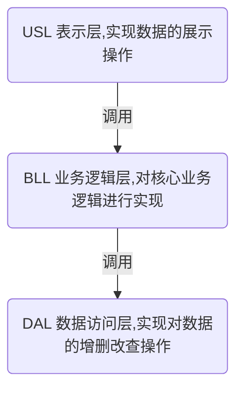

三层结构是服务端开发中最为基础的一种结构，也是作为简单项目最为常见的一种结构。本文件将对“如何在三层结构中使用依赖注入”进行介绍。

<!-- more -->

## 三层结构简述

一般而言，三层结构可以描述为以下形式



## 业务需求

本文需要实现的业务需求大致如下：

在控制台中展示学生的信息

## 代码演练

### 版本1，不使用接口

```csharp
using System;
using System.Collections.Generic;

namespace Use_Dependency_Injection_In_Simple_Three_Layers
{
    public static class Demo1
    {
        public static void Run()
        {
            Console.WriteLine($"开始运行{nameof(Demo1)}");
            var studentBll = new StudentBll();
            var students = studentBll.GetStudents();
            foreach (var student in students)
            {
                Console.WriteLine(student);
            }
            Console.WriteLine($"结束运行{nameof(Demo1)}");
        }

        public class StudentBll
        {
            public IEnumerable<Student> GetStudents()
            {
                var studentDal = new StudentDal();
                var re = studentDal.GetStudents();
                return re;
            }
        }

        public class StudentDal
        {
            private readonly IList<Student> _studentList = new List<Student>
            {
                new Student
                {
                    Id = "11",
                    Name = "月落"
                },
                new Student
                {
                    Id = "12",
                    Name = "Traceless",
                }
            };

            public IEnumerable<Student> GetStudents()
            {
                return _studentList;
            }
        }

        public class Student
        {
            public string Id { get; set; }
            public string Name { get; set; }

            public override string ToString()
            {
                return $"{nameof(Id)}: {Id}, {nameof(Name)}: {Name}";
            }
        }
    }
}

```

简要分析。在绝大多数的场景下，这是最不可取的反例做法。详细的原因可以从下文的改造中得出。

### 版本2，使用接口，使用依赖注入

```csharp
using System;
using System.Collections.Generic;

namespace Use_Dependency_Injection_In_Simple_Three_Layers
{
    public static class Demo2
    {
        public static void Run()
        {
            Console.WriteLine($"开始运行{nameof(Demo2)}");
            // 使用 StudentDal1
            IStudentBll studentBll = new StudentBll(new StudentDal1());
            var students = studentBll.GetStudents();
            foreach (var student in students)
            {
                Console.WriteLine(student);
            }
            // 使用 StudentDal2
            studentBll = new StudentBll(new StudentDal2());
            students = studentBll.GetStudents();
            foreach (var student in students)
            {
                Console.WriteLine(student);
            }
            Console.WriteLine($"结束运行{nameof(Demo2)}");
        }

        public interface IStudentBll
        {
            IEnumerable<Student> GetStudents();
        }

        public class StudentBll : IStudentBll
        {
            private readonly IStudentDal _studentDal;

            /**
             * 通过构造函数传入一个 IStudentDal 这种方式称为“构造函数注入”
             * 使用构造函数注入的方式，使得不依赖于特定的 IStudentDal 实现。
             * 只要 IStudentDal 接口的定义不修改，该类就不需要修改，实现了DAL与BLL的解耦
             */
            public StudentBll(
                IStudentDal studentDal)
            {
                _studentDal = studentDal;
            }

            public IEnumerable<Student> GetStudents()
            {
                var re = _studentDal.GetStudents();
                return re;
            }
        }

        public interface IStudentDal
        {
            IEnumerable<Student> GetStudents();
        }

        public class StudentDal1 : IStudentDal
        {
            private readonly IList<Student> _studentList = new List<Student>
            {
                new Student
                {
                    Id = "12",
                    Name = "Traceless",
                }
            };

            public IEnumerable<Student> GetStudents()
            {
                return _studentList;
            }
        }

        public class StudentDal2 : IStudentDal
        {
            private readonly IList<Student> _studentList = new List<Student>
            {
                new Student
                {
                    Id = "11",
                    Name = "月落"
                }
            };

            public IEnumerable<Student> GetStudents()
            {
                return _studentList;
            }
        }

        public class Student
        {
            public string Id { get; set; }
            public string Name { get; set; }

            public override string ToString()
            {
                return $"{nameof(Id)}: {Id}, {nameof(Name)}: {Name}";
            }
        }
    }
}

```

简要分析。与版本1相比，通过**定义接口**和使用**构造函数注入**实现了BLL和DAL层的解耦。实现了DAL层的切换，这个过程中没有修改`StudentBll`代码。

### 版本3，使用Autofac

```csharp
using Autofac;
using System;
using System.Collections.Generic;

namespace Use_Dependency_Injection_In_Simple_Three_Layers
{
    public static class Demo3
    {
        public static void Run()
        {
            Console.WriteLine($"开始运行{nameof(Demo3)}");
            // 使用 StudentDal1
            var cb = new ContainerBuilder();
            cb.RegisterType<StudentBll>().As<IStudentBll>();
            cb.RegisterType<StudentDal1>().As<IStudentDal>();
            var container = cb.Build();

            var studentBll = container.Resolve<IStudentBll>();
            var students = studentBll.GetStudents();
            foreach (var student in students)
            {
                Console.WriteLine(student);
            }
            // 使用 StudentDal2
            cb = new ContainerBuilder();
            cb.RegisterType<StudentBll>().As<IStudentBll>();
            cb.RegisterType<StudentDal2>().As<IStudentDal>();
            container = cb.Build();

            studentBll = container.Resolve<IStudentBll>();
            students = studentBll.GetStudents();
            foreach (var student in students)
            {
                Console.WriteLine(student);
            }
            Console.WriteLine($"结束运行{nameof(Demo3)}");
        }

        public interface IStudentBll
        {
            IEnumerable<Student> GetStudents();
        }

        public class StudentBll : IStudentBll
        {
            private readonly IStudentDal _studentDal;

            /**
             * 通过构造函数传入一个 IStudentDal 这种方式称为“构造函数注入”
             * 使用构造函数注入的方式，使得不依赖于特定的 IStudentDal 实现。
             * 只要 IStudentDal 接口的定义不修改，该类就不需要修改，实现了DAL与BLL的解耦
             */
            public StudentBll(
                IStudentDal studentDal)
            {
                _studentDal = studentDal;
            }

            public IEnumerable<Student> GetStudents()
            {
                var re = _studentDal.GetStudents();
                return re;
            }
        }

        public interface IStudentDal
        {
            IEnumerable<Student> GetStudents();
        }

        public class StudentDal1 : IStudentDal
        {
            private readonly IList<Student> _studentList = new List<Student>
            {
                new Student
                {
                    Id = "12",
                    Name = "Traceless",
                }
            };

            public IEnumerable<Student> GetStudents()
            {
                return _studentList;
            }
        }

        public class StudentDal2 : IStudentDal
        {
            private readonly IList<Student> _studentList = new List<Student>
            {
                new Student
                {
                    Id = "11",
                    Name = "月落"
                }
            };

            public IEnumerable<Student> GetStudents()
            {
                return _studentList;
            }
        }

        public class Student
        {
            public string Id { get; set; }
            public string Name { get; set; }

            public override string ToString()
            {
                return $"{nameof(Id)}: {Id}, {nameof(Name)}: {Name}";
            }
        }
    }
}

```

简要分析。与版本2相比，只修改了`Run`中的代码。因为在实际项目中，类之间的依赖关系错综复杂，有时特定的类需要注入多个接口，如果采用版本2的做法，则需要频繁修改`new`的过程。使用`Autofac`实现自动的依赖注入，无需自行管理实例，更为方便。

> 版本3需要通过nuget安装Autofac

## 总结

使用依赖注入，可以实现代码之间的解耦。通过解耦，可以实现代码之间的相互独立。使得代码的影响面变小，更加可控。

[本文示例代码地址](https://github.com/newbe36524/Newbe.Demo/tree/master/src/BlogDemos/Use-Dependency-Injection-In-CSharp/Use-Dependency-Injection-In-Simple-Three-Layers)

<!-- md Nav-Use-Dependency-Injection.md -->
