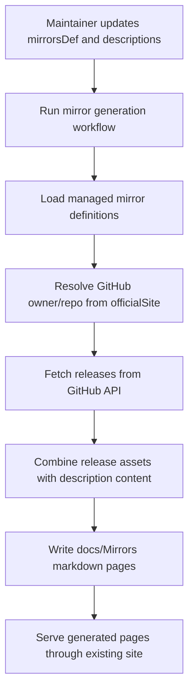
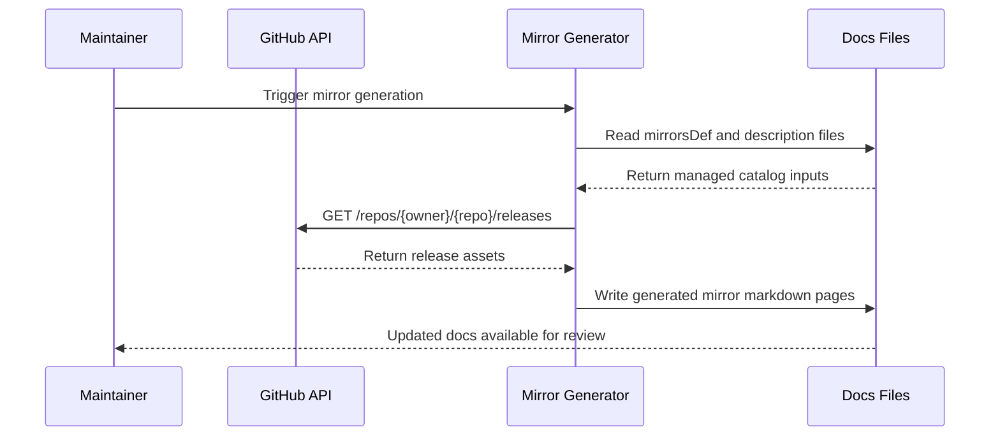

## Context

`repos/newbe` 当前已经通过 `tools/mirrorsDef.json`、`tools/MirrorDescription/*.md` 和 `tools/tasks.py` 维护并生成 GitHub Mirror 页面。现有实现能够根据 `officialSite` 推导 GitHub `owner/repo`，从 GitHub Releases API 拉取资产，并产出 `docs/Mirrors/*.md` 页面。

这次变更的核心不是重写 Mirror 机制，而是在现有生成模型上补齐一批高价值 A 档仓库。仓库现状表明：

- `PowerToys`、`PowerShell` 已经存在于镜像定义和生成文档中。
- 本次目标中的其他仓库还没有进入镜像定义，也缺少对应的描述素材与生成页面。
- 代码中尚不存在单独的 A 档字段或优先级建模；当前“优先同步”更多体现为受管仓库名单本身。

## Goals / Non-Goals

**Goals:**

- 在现有 Mirror 生成链路中纳入本次指定的 A 档 GitHub 仓库。
- 保证每个新增仓库同时具备目录定义、描述素材和可生成页面。
- 保持既有 `PowerToys`、`PowerShell` 页面能力稳定，不引入重复定义。
- 为后续实现阶段提供明确的文件落点、校验点和风险边界。

**Non-Goals:**

- 不在本次变更中设计新的管理后台或用户侧交互界面。
- 不在本次变更中重构 `create_github_mirror` 的整体生成模式。
- 不在本次变更中引入正式的仓库分层数据模型、排序算法或推荐策略。
- 不在本次变更中处理“过滤 symbols/debug 资产”这类资产筛选策略优化。

## Page Output Snapshot

本次变更不调整页面布局，仅扩展现有页面模板覆盖的仓库集合。

```text
Mirrors Page
├── Frontmatter
├── Repository intro
├── HagicodeRecommendation
├── GithubMirrorLink list
├── OneDrive block (optional)
└── Historical release sections
```

## Detailed Component Architecture

```text
Mirror Content Pipeline
├── tools/mirrorsDef.json
│   └── GitHub repository entries
├── tools/MirrorDescription/
│   └── Per-repository copy blocks
├── tools/tasks.py
│   ├── load_mirrors_def
│   ├── create_mirrors
│   └── create_github_mirror
├── docs/Mirrors/
│   └── Generated mirror markdown pages
└── src/components/
    ├── GithubMirrorLink
    ├── HagicodeRecommendation
    └── _onedrive.md (optional include)
```

## Data Flow Diagram



## API Call Sequence Diagram



## Decisions

### Decision: Reuse the existing GitHub mirror generation pipeline

继续使用 `tools/mirrorsDef.json` + `tools/tasks.py#create_github_mirror` 作为新增仓库的唯一接入路径。

- Rationale: 现有实现已经支持从 GitHub Releases API 拉取资产并生成页面，新增仓库本质上是目录扩容，不需要新的执行模型。
- Alternative considered: 引入新的 “A 档仓库” 独立配置文件或字段。
- Why not chosen: 当前代码没有消费者依赖 tier 字段；先做目录扩容风险更低，也更符合这次变更目标。

### Decision: Treat existing PowerToys and PowerShell entries as canonical

对 `PowerToys`、`PowerShell` 不新增第二份定义，而是保留现有条目并在实现中校验它们仍属于本次 A 档范围。

- Rationale: 避免目录重复、文档重复和生成歧义。
- Alternative considered: 删除后重建这两个条目。
- Why not chosen: 没有收益，还会引入不必要的回归风险。

### Decision: Add per-repository description files for every new A-tier repository

每个新增仓库都使用 `tools/MirrorDescription/<SoftwareName>.md` 作为内容源，保持与现有生成模型一致。

- Rationale: `create_github_mirror` 已经依赖描述文件拼接页面正文，缺少描述会导致新增页面内容不完整。
- Alternative considered: 在 `mirrorsDef.json` 内联描述。
- Why not chosen: 会破坏现有内容组织方式，也不利于后续文案维护。

### Decision: Use a provisional description for OpenAgentPlatform/Dive

对 `OpenAgentPlatform/Dive` 采用临时业务理由，先保障目录接入和页面生成，再在后续实现或内容复核中补充更准确的说明。

- Rationale: 用户已经明确要求纳入该仓库，且当前工作流为非交互模式。
- Alternative considered: 因理由未补齐而暂缓纳入。
- Why not chosen: 会使交付范围与用户输入不一致。

## Detailed Code Change Inventory

| File Path | Change Type | Change Description | Affected Module |
|-----------|-------------|-------------------|-----------------|
| `tools/mirrorsDef.json` | Modify | 新增 12 个 GitHub 仓库条目，并复核 2 个已存在条目 | Mirror catalog |
| `tools/MirrorDescription/*.md` | Add | 为新增仓库补充描述素材 | Mirror content source |
| `docs/Mirrors/Mirrors-*.md` | Generate | 产出新增仓库页面并刷新受影响页面 | Generated docs |
| `tools/tasks.py` | Verify/Modify | 仅在现有生成逻辑无法覆盖新增仓库时做兼容修正 | Mirror generator |
| `tools/tests/*mirror*` | Add/Modify | 增加目录覆盖、生成产物与重复定义校验 | Test coverage |

## Risks / Trade-offs

- [GitHub API 限流或异常返回] → 复用现有回退逻辑，并为新增仓库补充可回归的生成测试。
- [仓库命名与页面文件名不统一] → 在实现中明确 `softwareName` 与 `markdownFilename` 映射，避免大小写和符号不一致。
- [新增仓库缺少成熟描述文案] → 先补最低可用描述，后续再做内容优化。
- [PowerToys/PowerShell 被重复添加] → 在实现时增加重复条目检查或回归断言。

## Migration Plan

1. 更新 `tools/mirrorsDef.json`，录入新增 A 档仓库并确认既有仓库不重复。
2. 新增对应的 `tools/MirrorDescription/*.md` 文案文件。
3. 运行镜像生成流程，生成或刷新 `docs/Mirrors/*.md`。
4. 补充或更新测试，验证新增页面存在且既有页面未回退。
5. 如需回滚，移除新增目录项与描述文件后重新生成页面即可恢复到变更前状态。

## Open Questions

- 是否需要在后续单独引入显式的 `tier` 或 `priority` 字段，供运营和筛选逻辑复用？
- 是否要在后续版本中针对大体积 debug/symbol 资产增加筛选或排序优化？
- `OpenAgentPlatform/Dive` 的最终业务理由和描述文案是否需要产品侧再确认？
