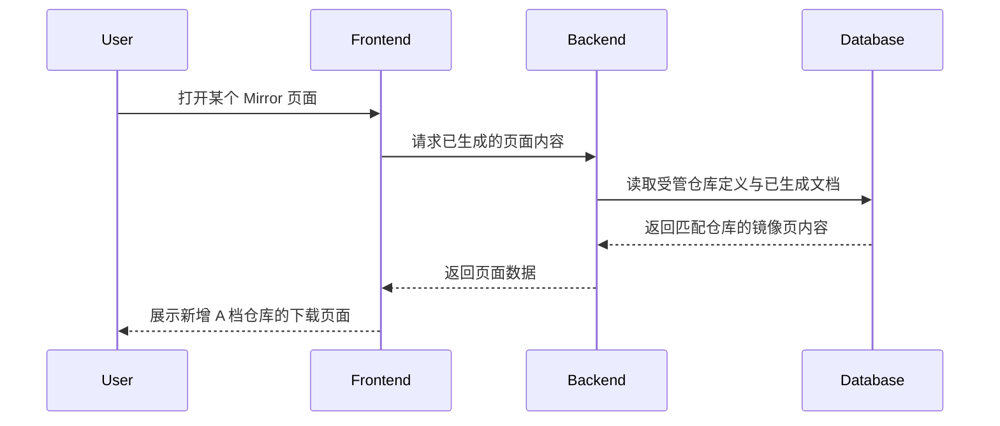

## Why

Mirror 当前已经支持一批 GitHub Release 镜像页生成，但还没有覆盖这一轮 A 档优先同步目标中的大部分高价值仓库。现在补齐这些仓库，可以更好地服务 Windows 工具、AI 本地推理和开发工具用户对大体积 Release 资产的下载需求，并把现有脚本能力投入到更高价值的分发对象上。

## What Changes

- 扩展 Mirror 的 A 档优先同步范围，将以下 GitHub 仓库纳入受管目录：`microsoft/azuredatastudio`、`Eugeny/tabby`、`agalwood/Motrix`、`marktext/marktext`、`electron/fiddle`、`go-gitea/gitea`、`desktop/desktop`、`wez/wezterm`、`ggml-org/llama.cpp`、`mudler/LocalAI`、`nomic-ai/gpt4all`、`OpenAgentPlatform/Dive`。
- 复核并保留当前已存在于 Mirror 目录中的 A 档仓库：`microsoft/PowerToys`、`PowerShell/PowerShell`，避免重复定义或回退现有页面能力。
- 为新增仓库补齐镜像定义所需的描述和页面生成输入，使 Mirror 生成脚本能够输出对应的 `docs/Mirrors/*.md` 页面。
- 为 `OpenAgentPlatform/Dive` 采用非交互默认假设：先按 AI Agent 工具链相关高价值仓库纳入 A 档，具体业务理由在实现时补齐到描述文案中。

## Capabilities

### New Capabilities
- `mirror-tier-a-catalog`: 定义和维护 Mirror 的 A 档 GitHub 仓库目录，要求目标仓库在镜像定义、描述素材和生成页面中保持一致。

### Modified Capabilities
- None.

## Impact

- 受影响代码与数据：
  - `tools/mirrorsDef.json`
  - `tools/MirrorDescription/*.md`
  - `docs/Mirrors/*.md`
  - `tools/tasks.py`
  - `tools/tests/*mirror*`
- 外部依赖：
  - GitHub Releases API 返回的发布资产列表
- 运行影响：
  - Mirror 页面生成批次会新增多篇 GitHub Release 镜像页面
  - 已存在的 `PowerToys`、`PowerShell` 页面需要继续保持可生成

## High-level UI Prototype

本次变更不涉及新的前端交互界面，以下原型用于说明用户最终看到的 Mirror 页面结构不会发生布局级变化，只会新增更多仓库页面。

```text
┌──────────────────────────────────────────────┐
│ Mirrors / <SoftwareName>                [ ] │
├──────────────────────────────────────────────┤
│ 标题: 软件名称                               │
│ 简介: 仓库用途与下载价值说明                  │
│                                              │
│ [推荐镜像链接] [备用镜像链接] [官方地址]      │
│                                              │
│ 最新版本                                     │
│ - 资产 A                                     │
│ - 资产 B                                     │
│                                              │
│ 历史版本                                     │
│ - vX.Y.Z                                     │
│ - vX.Y.Y                                     │
└──────────────────────────────────────────────┘
状态说明: normal=现有布局复用, hover=链接高亮, disabled=无新增交互, error=GitHub API 拉取失败时回退既有页面
```

## User Interaction Flow



## Code Change Table

| File Path | Change Type | Change Reason | Impact Scope |
|-----------|-------------|---------------|--------------|
| `tools/mirrorsDef.json` | Modify | 增加 A 档目标仓库定义，复核已存在条目 | 镜像源目录 |
| `tools/MirrorDescription/*.md` | Add/Modify | 为新增仓库补充说明文案 | 页面内容素材 |
| `docs/Mirrors/*.md` | Generate | 生成或刷新对应仓库镜像页 | 用户可见内容 |
| `tools/tasks.py` | Verify/Modify | 确保新增目录项可被现有生成流程消费 | 生成逻辑 |
| `tools/tests/*mirror*` | Add/Modify | 为新增目录项和生成路径补充回归覆盖 | 自动化验证 |
