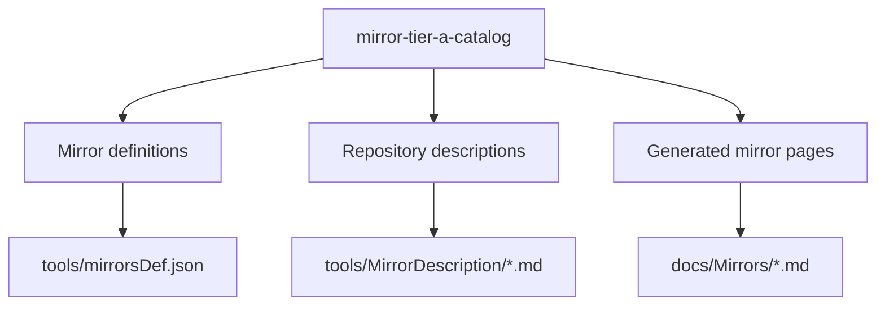

## Capability Model

## Functional Requirements

| Requirement | Summary | Verification Focus |
|-------------|---------|--------------------|
| A-tier catalog coverage | A 档仓库目录必须覆盖本次指定仓库 | 镜像定义完整性 |
| Content parity | 每个 A 档仓库必须同时具备描述素材和生成页面 | 内容一致性 |
| Existing entry preservation | 已存在的 A 档仓库不得重复录入或丢失生成能力 | 回归稳定性 |

## ADDED Requirements

### Requirement: A-tier repository catalog SHALL include the requested GitHub repositories
The system SHALL maintain an A-tier Mirror catalog that covers the requested GitHub repositories for this change. The catalog MUST include `microsoft/azuredatastudio`, `Eugeny/tabby`, `agalwood/Motrix`, `marktext/marktext`, `electron/fiddle`, `go-gitea/gitea`, `desktop/desktop`, `wez/wezterm`, `ggml-org/llama.cpp`, `mudler/LocalAI`, `nomic-ai/gpt4all`, and `OpenAgentPlatform/Dive`, while preserving the already managed `microsoft/PowerToys` and `PowerShell/PowerShell`.

#### Scenario: Missing A-tier repositories are added to the managed catalog
- **WHEN** maintainers review the managed GitHub mirror definitions for this change
- **THEN** every requested repository appears in the catalog with a GitHub mirror entry

#### Scenario: Existing A-tier repositories are preserved without duplication
- **WHEN** maintainers inspect the catalog entries for `PowerToys` and `PowerShell`
- **THEN** each repository remains represented by a single active managed entry rather than duplicated records

### Requirement: A-tier repositories SHALL have synchronized source definition and description content
For every repository in the A-tier catalog, the system SHALL keep the mirror definition and the repository description content synchronized so that page generation has all required inputs. If a repository lacks finalized business rationale at authoring time, the system MUST still carry a provisional description that keeps generation unblocked and marks the copy for later refinement.

#### Scenario: A newly added repository has generation inputs
- **WHEN** a repository is added to the A-tier catalog
- **THEN** it also has corresponding description content available to the page generation workflow

#### Scenario: Dive uses a provisional rationale without blocking inclusion
- **WHEN** `OpenAgentPlatform/Dive` is included before its final business rationale is finalized
- **THEN** the repository still has a provisional description that allows the generated page to be created

### Requirement: A-tier repository pages SHALL be generated from the managed catalog
The system SHALL generate or refresh a mirror page for every A-tier repository from the managed catalog so that users can access release assets through the existing Mirror page layout and mirror link components.

#### Scenario: Newly added repository produces a mirror page
- **WHEN** the mirror generation workflow runs after catalog updates
- **THEN** each newly added A-tier repository has a corresponding page under `docs/Mirrors/`

#### Scenario: Existing A-tier repository page remains generatable
- **WHEN** the mirror generation workflow runs for the full catalog
- **THEN** the `PowerToys` and `PowerShell` pages continue to be generated successfully
