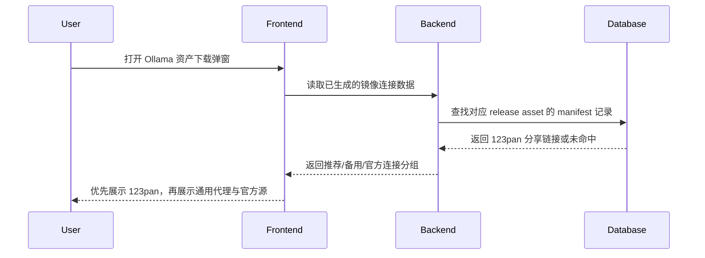
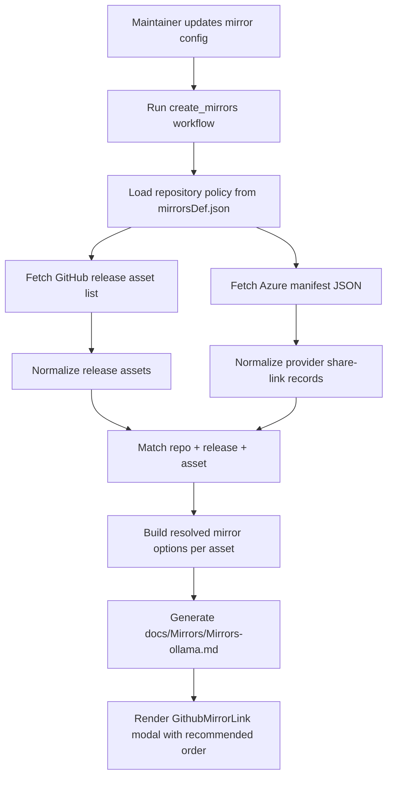
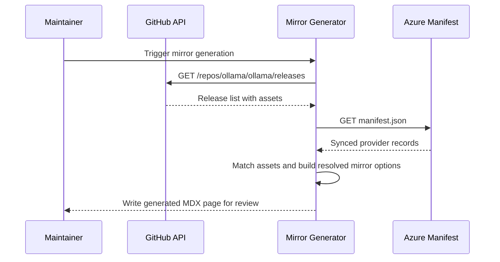

## Context

`repos/newbe` 当前的 GitHub Mirror 生成流程由 `tools/tasks.py#create_github_mirror` 驱动：它从 `tools/mirrorsDef.json` 读取镜像定义，直接请求 GitHub Releases API，再通过 `tools/mirror/github/__init__.py#get_github_version_section` 生成 `<GithubMirrorLink link={...} />` 列表，最后写入 `docs/Mirrors/*.md`。这条链路只有一个核心输入，即 GitHub 原始资产链接。

前端侧的 `src/components/GithubMirrorLink` 也建立在这个前提上。它会把传入的 GitHub 原始链接与 `config.ts` 中硬编码的推荐代理前缀和备用代理前缀进行拼接，因此只能表达“同一条 GitHub URL 的不同代理入口”，不能表达“某个具体资产已经有独立的第三方分享链接”。这正是 Ollama 集成 123pan 的主要缺口。

在参考项目 `newbe-mono` 中，`release-sync-metadata-index` 与 `pan123-provider-adapter` 两个 capability 已经定义了 Azure Blob JSON manifest、资产级同步元数据和 123pan 分享链接收据的基本契约。因此本次设计采用非交互默认假设：

- Azure manifest 所在容器会以 container 级 SAS URL 暴露，具体 blob 路径按 `<AZURE_STORAGE_PREFIX>/<owner>/<repo>/<releaseTagName>/manifest.json` 约定推导，默认 prefix 为 `release-sync`；
- manifest 中至少包含仓库标识、版本标识或发布标识、资产标识、provider 名称、分享链接和同步状态；
- `repos/newbe` 只负责消费这些元数据并生成文档，不负责上传到 123pan 或维护同步任务。

## Goals / Non-Goals

**Goals:**

- 让 `repos/newbe` 在构建期读取 Azure manifest，并为支持的 GitHub 仓库识别已同步的第三方分享链接。
- 为 `ollama/ollama` 输出“123pan 优先、通用代理回退、官方源保底”的下载连接顺序。
- 让 `GithubMirrorLink` 同时支持默认代理前缀镜像和按资产计算出的 provider 直链。
- 将仓库策略和 provider 数据模型做成可扩展结构，避免未来支持其他 GitHub mirror/provider 时再拆组件或重写生成脚本。
- 保证 manifest 缺失、网络失败或资产未同步时不影响现有 Mirror 页面继续生成。

**Non-Goals:**

- 不在本次变更中实现 Azure manifest 的生产、上传或生命周期管理。
- 不在本次变更中为所有镜像仓库全面接入 123pan，仅对 `ollama` 首次落地并保留通用扩展入口。
- 不在本次变更中新增运行时 API、后台管理界面或客户端请求逻辑，所有链接决策都在文档生成阶段完成。
- 不在本次变更中改造 Docusaurus 页面结构、文案样式或 `MirrorCard` 的视觉体系。

## High-level UI Prototype

```text
┌──────────────────────────────────────────────────────────┐
│ 选择下载方式                                        [✕] │
├──────────────────────────────────────────────────────────┤
│ 推荐加速器                                               │
│ ┌──────────────────────────────────────────────────────┐ │
│ │ [推荐] 123pan 分享链接                               │ │
│ │ 已同步资产 · 可直接进入分享页                        │ │
│ │ [打开] [复制]                                        │ │
│ └──────────────────────────────────────────────────────┘ │
│ ┌──────────────────────────────────────────────────────┐ │
│ │ ghproxy.com                                          │ │
│ │ GitHub 代理回退线路                                  │ │
│ │ [打开] [复制]                                        │ │
│ └──────────────────────────────────────────────────────┘ │
│ 备用加速器                                               │
│ [ghps.cc] [gh.ddlc.top]                                 │
│ 官方源                                                   │
│ [GitHub 原始地址]                                       │
└──────────────────────────────────────────────────────────┘
```

## User Interaction Flow



## Decisions

### Decision: Fetch and merge Azure manifest at documentation generation time

在 `tools/tasks.py` 的 GitHub mirror 生成流程中拉取 Azure manifest，并在构建期把匹配到的 provider 直链写入生成后的 MDX。

- Rationale: `repos/newbe` 是静态站点，现有 Mirror 页也是构建期生成；继续在构建期完成链接编排可以避免新增运行时 API 和客户端跨域依赖。
- Alternative considered: 在 `GithubMirrorLink` 组件运行时直接向 Azure Blob 拉取 manifest。
- Why not chosen: 会引入客户端网络依赖、缓存一致性和失败态处理复杂度，也偏离当前静态内容生成模式。

### Decision: Introduce a provider-agnostic resolved mirror model

为每个资产计算一个“已解析连接列表”，其中既可以包含 `urlPrefix + githubLink` 形式的代理镜像，也可以包含像 123pan 这样直接给出 `fullUrl` 的 provider 直链。

- Rationale: 当前组件只认识“前缀镜像”，无法表达独立分享页。改为统一的已解析连接模型后，前端无需区分 URL 是拼接出来的还是 manifest 提供的。
- Alternative considered: 为 123pan 单独增加一个布尔开关和一个分享链接字段。
- Why not chosen: 这种做法会把组件逻辑硬编码到单一 provider，后续接入其他 GitHub mirror/provider 时还要继续加专用字段。

### Decision: Keep repository policy in mirror definitions instead of hardcoding Ollama in React

在 `tools/mirrorsDef.json` 中为 `ollama` 定义 manifest 来源和推荐 provider 列表，由生成脚本决定哪些 provider 进入推荐区、备用区和官方源区，而不是在 React 组件里写死 “如果 softwareName 是 ollama 就展示 123pan”。

- Rationale: 仓库级策略属于内容生成配置，不应散落在前端组件逻辑里。
- Alternative considered: 在 `src/components/GithubMirrorLink/index.tsx` 中根据链接或页面标题写 Ollama 特判。
- Why not chosen: 会让组件与单个仓库耦合，且未来迁移到其他仓库时难以复用。

### Decision: Gracefully degrade when manifest is unavailable or incomplete

manifest 拉取失败、返回异常或某个资产没有找到同步记录时，页面必须继续使用当前默认代理和官方源，而不是中断页面生成。

- Rationale: 用户当前至少还能使用通用 GitHub 代理，不能因为增量能力失败而回退到无页面或无下载入口。
- Alternative considered: 把 manifest 视为强依赖，缺失时直接生成失败。
- Why not chosen: 风险过高，与“在现有代理能力上增强”的目标冲突。

### Decision: Limit the first rollout to Ollama while preserving a reusable contract

本次仅为 `ollama/ollama` 启用 123pan 推荐策略，但生成脚本、配置结构和前端类型都按多仓库、多 provider 设计。

- Rationale: 用户诉求集中在 Ollama，先做单仓库交付能控制范围，同时不锁死扩展路径。
- Alternative considered: 一次性为所有现有 GitHub mirror 仓库尝试接 manifest。
- Why not chosen: 缺少对应 manifest 数据，且会大幅扩大验证范围。

## Detailed Component Architecture

```text
Mirror Generation and Rendering
├── tools/mirrorsDef.json
│   └── Repository policy
│       ├── officialSite
│       ├── manifest source
│       └── preferred providers
├── tools/tasks.py
│   ├── load_mirrors_def
│   ├── fetch_github_releases
│   ├── fetch_azure_manifest          (new helper or module call)
│   ├── match_asset_provider_links    (new helper or module call)
│   └── create_github_mirror
├── tools/mirror/github/__init__.py
│   └── render GithubMirrorLink calls with resolved mirrors
├── docs/Mirrors/Mirrors-ollama.md
│   └── Generated MDX with per-asset mirror options
└── src/components/GithubMirrorLink
    ├── types.ts
    │   └── Resolved mirror link types
    ├── config.ts
    │   └── Default proxy definitions
    ├── index.tsx
    │   └── Merge direct providers with default proxies
    └── MirrorCard / MirrorSection
        └── Reuse existing card layout
```

## Data Flow Diagram



## API Call Sequence Diagram



## Code Change Table

| File Path | Change Type | Change Reason | Impact Scope |
|-----------|-------------|---------------|--------------|
| `tools/tasks.py` | Modify | 拉取 Azure manifest 并组装按资产解析的镜像连接列表 | 构建期生成逻辑 |
| `tools/mirror/github/__init__.py` | Modify | 输出带 `customMirrors` 或等价数据结构的 MDX 片段 | MDX 模板生成 |
| `tools/mirrorsDef.json` | Modify | 为 Ollama 增加 Azure container SAS URL 环境变量、blob prefix 与 provider 策略配置 | 仓库定义 |
| `src/components/GithubMirrorLink/types.ts` | Modify | 定义已解析 provider 直链与默认代理的统一类型 | 前端类型 |
| `src/components/GithubMirrorLink/config.ts` | Modify | 将默认代理转换为可与直链合并的连接列表 | 前端默认配置 |
| `src/components/GithubMirrorLink/index.tsx` | Modify | 按推荐顺序渲染 123pan、代理回退和官方源 | 下载弹窗 |
| `docs/Mirrors/Mirrors-ollama.md` | Generate | 输出带 123pan 推荐项的 Ollama 页面 | 用户可见内容 |
| `tools/tests/test_ollama_123pan_manifest.py` | Add | 验证 manifest 解析、链接匹配和降级逻辑 | Python 回归测试 |

## Detailed Code Change Inventory

| File Path | Change Type | Change Description | Affected Module |
|-----------|-------------|-------------------|-----------------|
| `tools/tasks.py` | Modify | 新增 manifest 获取、缓存、匹配和传参逻辑，扩展 `create_github_mirror` | Mirror generator |
| `tools/mirror/github/__init__.py` | Modify | 为每个资产输出扩展后的 `GithubMirrorLink` 调用参数 | Markdown generation |
| `tools/mirrorsDef.json` | Modify | 给 `ollama` 定义 Azure container SAS URL 环境变量、blob prefix、repo key、preferred providers 等元数据 | Mirror catalog |
| `src/components/GithubMirrorLink/types.ts` | Modify | 添加已解析镜像项、provider 优先级和直链字段类型 | React types |
| `src/components/GithubMirrorLink/config.ts` | Modify | 将默认代理改为可与外部 provider 合并的基础配置 | React config |
| `src/components/GithubMirrorLink/index.tsx` | Modify | 合并传入 provider 与默认代理，分组展示推荐/备用/官方源 | React modal |
| `docs/Mirrors/Mirrors-ollama.md` | Generate | 把匹配到 123pan 的资产渲染为推荐下载项 | Generated docs |
| `tools/tests/test_ollama_123pan_manifest.py` | Add | 针对 manifest 可用、缺失、未命中三类路径增加测试 | Python tests |

## Risks / Trade-offs

- [Azure manifest schema 与站点消费字段不完全一致] -> 先在生成脚本中做显式字段映射和兼容解析，只依赖最小必要字段。
- [manifest 拉取失败导致构建不稳定] -> 将 manifest 能力设计为可降级增强，失败时继续生成默认代理页面。
- [资产匹配规则过于宽松导致错误分享链接绑定] -> 以仓库标识、版本标识和资产名三元组优先匹配，并为错配路径补测试。
- [前端组件改造影响所有 GitHub mirror 页面] -> 保持默认 props 向后兼容；未传入 provider 直链时继续沿用现有渲染。
- [后续 provider 类型增加时字段再次膨胀] -> 在第一版就采用统一的已解析连接模型，而不是为 123pan 写一次性字段。

## Migration Plan

1. 为 `ollama` 在 `tools/mirrorsDef.json` 中声明 manifest 消费配置和推荐 provider 顺序。
2. 在 Python 生成链路中增加 manifest 拉取、解析和按资产匹配逻辑。
3. 扩展 `GithubMirrorLink` 组件的 props 和分组逻辑，使其能消费按资产解析后的 provider 直链。
4. 重新生成 `docs/Mirrors/Mirrors-ollama.md`，验证 123pan 出现在推荐区首位。
5. 增加 Python 回归测试并执行 `npm run typecheck`，确认旧页面路径不回退。
6. 如需回滚，只需移除 `ollama` 的 manifest/provider 配置并恢复组件对默认代理的单一路径消费。

## Open Questions

- 已确认：站点配置只需要提供 Azure container 级 SAS URL；manifest blob 路径按 `<AZURE_STORAGE_PREFIX>/<owner>/<repo>/<releaseTagName>/manifest.json` 约定推导，默认 prefix 为 `release-sync`。
- 当 123pan 分享链接存在访问密码、提取码或过期时间时，是否需要在后续版本中把附加元数据暴露到卡片描述？
- 非 Ollama 仓库未来如果接入其他 provider，是否需要统一的运营级排序规则，还是继续由每个仓库单独声明？
