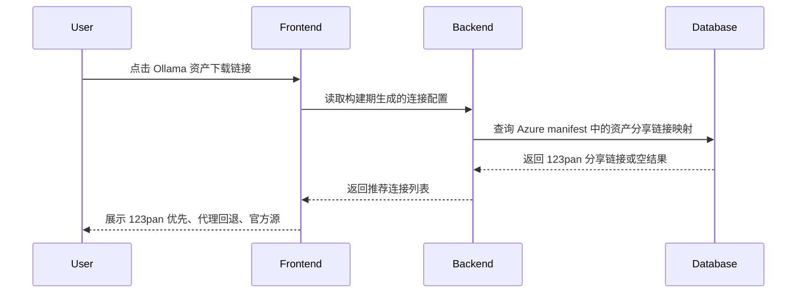

## Why

当前 `repos/newbe` 的 GitHub Mirror 页面只能基于 GitHub 原始下载链接叠加通用代理前缀，无法识别哪些 Ollama Release 资产已经同步到了 123pan，也无法把 123pan 作为国内用户的首推下载方式。现在补上 Azure manifest 驱动的分享链接发现和连接策略，可以在不牺牲现有代理回退能力的前提下，为 Ollama 提供更稳定的下载入口，并为后续其他 GitHub mirror 场景复用同一套扩展模型。

## What Changes

- 为 GitHub Mirror 生成流程增加 Azure manifest 拉取与解析能力，按仓库、版本和资产识别已经同步到 123pan 的分享链接。
- 扩展 `GithubMirrorLink` 的连接模型，使其既能展示现有的 GitHub 代理前缀镜像，也能展示按资产生成的直达分享链接。
- 为 `ollama/ollama` 增加仓库级连接策略配置，在存在已同步分享链接时将 123pan 置于“推荐加速器”的首位，并保留现有 GitHub 代理和官方源作为回退路径。
- 将分享链接接入设计为可扩展的 provider 架构，避免后续支持其他 GitHub mirror 或网盘提供商时重复改造页面生成和前端弹窗。
- 采用非交互默认假设：Azure manifest 所在容器会通过 container 级 SAS URL 暴露，具体 manifest blob 路径按 `<AZURE_STORAGE_PREFIX>/<owner>/<repo>/<releaseTagName>/manifest.json` 约定推导，且其中包含匹配 GitHub release 资产所需的仓库标识、版本标识、资产标识和分享链接字段。

## Capabilities

### New Capabilities
- `github-mirror-share-manifest`: 为 GitHub Mirror 生成流程提供 Azure manifest 驱动的第三方分享链接发现、匹配和降级能力。
- `github-mirror-connection-strategy`: 为单个 GitHub 资产定义可扩展的连接方式编排策略，支持仓库级推荐排序和 provider 直链接入。

### Modified Capabilities
- None.

## Impact

- 受影响代码与内容：
  - `tools/tasks.py`
  - `tools/mirror/github/__init__.py`
  - `tools/mirrorsDef.json`
  - `src/components/GithubMirrorLink/config.ts`
  - `src/components/GithubMirrorLink/types.ts`
  - `src/components/GithubMirrorLink/index.tsx`
  - `docs/Mirrors/Mirrors-ollama.md`
  - `tools/tests/test_ollama_123pan_manifest.py`
- 外部依赖：
  - Azure Blob 上发布的 manifest JSON
  - GitHub Releases API
- 运行影响：
  - `ollama` 镜像页的下载弹窗会优先展示 123pan 分享链接
  - Azure manifest 缺失或匹配失败时，页面继续回退到现有代理前缀镜像，不阻塞页面生成

## High-level UI Prototype

```text
┌──────────────────────────────────────────────────────────┐
│ 选择下载方式                                        [✕] │
├──────────────────────────────────────────────────────────┤
│ ⚠ 公开加速链接仅供学习交流使用                          │
│                                                          │
│ 推荐加速器                                               │
│ ┌──────────────────────────────────────────────────────┐ │
│ │ [推荐] 123pan 分享链接                               │ │
│ │ 直连分享页 · 已同步到国内网盘                        │ │
│ │ [打开] [复制]                                        │ │
│ └──────────────────────────────────────────────────────┘ │
│ ┌──────────────────────────────────────────────────────┐ │
│ │ ghproxy.com                                          │ │
│ │ 通用 GitHub 代理 · 回退线路                          │ │
│ │ [打开] [复制]                                        │ │
│ └──────────────────────────────────────────────────────┘ │
│                                                          │
│ 备用加速器 / 官方源                                      │
│ [ghps.cc] [gh.ddlc.top] [GitHub 原始地址]               │
└──────────────────────────────────────────────────────────┘
状态说明: normal=123pan 已同步时显示推荐卡片, hover=按钮高亮, disabled=manifest 无匹配时不显示 123pan, error=manifest 拉取失败时仅保留现有代理与官方源
```

## User Interaction Flow



## Code Change Table

| File Path | Change Type | Change Reason | Impact Scope |
|-----------|-------------|---------------|--------------|
| `tools/tasks.py` | Modify | 接入 Azure manifest、匹配 Ollama 资产并生成带 provider 直链的 MDX | 构建期生成逻辑 |
| `tools/mirror/github/__init__.py` | Modify | 让版本区块支持输出带附加连接选项的 `GithubMirrorLink` 调用 | 生成模板 |
| `tools/mirrorsDef.json` | Modify | 为 Ollama 声明 Azure container SAS URL 环境变量、blob prefix 和推荐 provider 策略 | 仓库配置 |
| `src/components/GithubMirrorLink/config.ts` | Modify | 让默认代理配置与 provider 直链共存并支持推荐排序 | 前端连接配置 |
| `src/components/GithubMirrorLink/types.ts` | Modify | 新增按资产传入的镜像连接类型定义 | 前端类型约束 |
| `src/components/GithubMirrorLink/index.tsx` | Modify | 渲染 123pan 推荐卡片并保留回退线路 | 用户可见下载弹窗 |
| `docs/Mirrors/Mirrors-ollama.md` | Generate | 输出带 123pan 分享链接能力的 Ollama 镜像页 | 用户可见内容 |
| `tools/tests/test_ollama_123pan_manifest.py` | Add | 覆盖 manifest 拉取、匹配和降级行为 | 自动化验证 |
