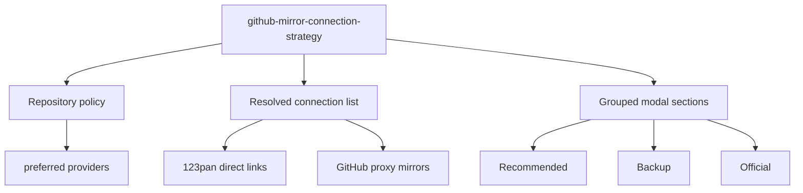

## Capability Model

## Functional Requirements

| Requirement | Summary | Verification Focus |
|-------------|---------|--------------------|
| Repository-scoped recommendation policy | 仓库可以定义推荐 provider 顺序 | 排序正确性 |
| Mixed connection rendering | 同一资产可以同时显示直链 provider 与默认代理 | UI 数据整合 |
| Backward compatibility | 未启用 provider 的仓库继续沿用现有弹窗体验 | 兼容性 |

## ADDED Requirements

### Requirement: Repository mirror policy SHALL support provider-specific recommendation ordering
The system SHALL allow a GitHub mirror repository to declare a preferred provider order and SHALL use that order to group and sort resolved download connections for each asset in the generated mirror page.

#### Scenario: Ollama prioritizes 123pan above generic proxies
- **WHEN** the generated mirror data for an Ollama asset contains both a 123pan share link and the default GitHub proxy mirrors
- **THEN** the download modal shows the 123pan option in the recommended section ahead of the generic proxy mirrors

#### Scenario: Repository without preferred providers keeps default ordering
- **WHEN** a repository does not declare any preferred provider order
- **THEN** the generated mirror data uses the existing default ordering of recommended proxies, backup proxies, and official source

### Requirement: GithubMirrorLink SHALL render both resolved provider links and prefix-based GitHub mirrors
The system SHALL allow `GithubMirrorLink` to render a unified list of resolved download connections that includes provider-specific direct URLs and the existing prefix-based GitHub proxy URLs for the same asset.

#### Scenario: Direct provider link is rendered as an actionable mirror card
- **WHEN** the generated page passes a resolved 123pan share link for an Ollama asset into `GithubMirrorLink`
- **THEN** the modal renders a mirror card that opens and copies the direct 123pan URL instead of attempting to prefix the GitHub URL

#### Scenario: Existing GitHub proxy mirrors remain available
- **WHEN** `GithubMirrorLink` receives a GitHub asset URL with no additional provider links
- **THEN** the modal still renders the current proxy-based recommended and backup mirrors together with the official source

### Requirement: Official source and fallback mirrors SHALL remain visible for provider-enabled assets
The system SHALL continue to expose the official GitHub source and at least the existing fallback proxy mirrors even when a preferred provider share link is available for an asset.

#### Scenario: Preferred provider is available
- **WHEN** an Ollama asset includes a synchronized 123pan share link
- **THEN** the modal shows 123pan as recommended while also retaining the configured fallback proxy mirrors and official GitHub source

#### Scenario: Preferred provider link is missing for one asset in a release
- **WHEN** one asset in an Ollama release lacks a synchronized 123pan record while other assets in the same release have one
- **THEN** the asset without the synchronized record still renders fallback proxy mirrors and official source instead of inheriting another asset's provider link
