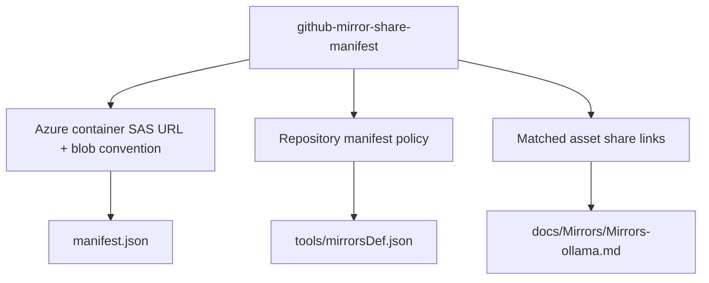

## Capability Model

## Functional Requirements

| Requirement | Summary | Verification Focus |
|-------------|---------|--------------------|
| Manifest retrieval | 站点生成流程必须能基于 Azure container SAS URL 读取版本化 manifest | 远程 JSON 获取与解析 |
| Asset-level matching | 分享链接必须按仓库、版本、资产粒度匹配到 GitHub release 资产 | 匹配准确性 |
| Graceful degradation | manifest 异常或未命中时不得阻塞页面生成 | 回退稳定性 |

## ADDED Requirements

### Requirement: GitHub mirror generation SHALL load Azure share-link manifests for enabled repositories
The system SHALL allow a GitHub mirror repository definition to declare an Azure container SAS URL source and SHALL derive the versioned manifest blob path during mirror page generation for repositories that opt into share-link discovery.

#### Scenario: Enabled repository loads its manifest during generation
- **WHEN** maintainers run mirror generation for a repository such as `ollama/ollama` that declares an Azure container SAS URL source
- **THEN** the generation workflow derives `<AZURE_STORAGE_PREFIX>/<owner>/<repo>/<releaseTagName>/manifest.json`
- **AND** it fetches and parses that manifest before it renders the repository page

#### Scenario: Repository without manifest configuration keeps the existing path
- **WHEN** maintainers run mirror generation for a repository that does not declare any manifest source
- **THEN** the generation workflow skips manifest retrieval and continues with the existing GitHub mirror generation path

### Requirement: Azure manifest records SHALL be matched to GitHub release assets at asset granularity
The system SHALL normalize manifest records into repository, release, asset, provider, and share-link fields and SHALL attach a provider share link to a generated asset entry only when the manifest record matches the same repository and release asset identity.

#### Scenario: Matched Ollama asset receives a 123pan share link
- **WHEN** the manifest contains a synchronized `ollama/ollama` record for release `v0.20.2` asset `OllamaSetup.exe`
- **THEN** the generated mirror data for `OllamaSetup.exe` includes the corresponding 123pan share link as a resolved provider option

#### Scenario: Unmatched asset does not receive a share link
- **WHEN** a GitHub release asset has no matching manifest record for its repository and asset identity
- **THEN** the generated mirror data for that asset omits the provider share link instead of attaching a guessed or stale URL

### Requirement: Share-link manifest failures SHALL degrade to the existing mirror experience
The system SHALL treat Azure manifest retrieval and parsing as an additive enhancement and SHALL continue generating the mirror page with the default GitHub proxy mirrors and official source when the manifest is unavailable, invalid, or incomplete.

#### Scenario: Manifest request fails
- **WHEN** the Azure manifest endpoint times out, returns an error response, or returns malformed JSON
- **THEN** mirror generation still completes and the generated page contains the existing default proxy mirrors and official source without provider share links

#### Scenario: Manifest exists but contains no synced records for Ollama
- **WHEN** the manifest is successfully fetched but no synchronized records match the current `ollama/ollama` assets
- **THEN** the generated page keeps the current default proxy ordering and does not emit empty provider cards
