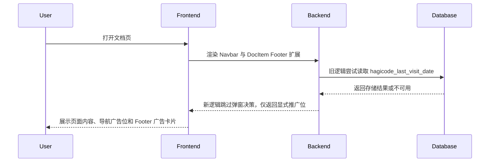
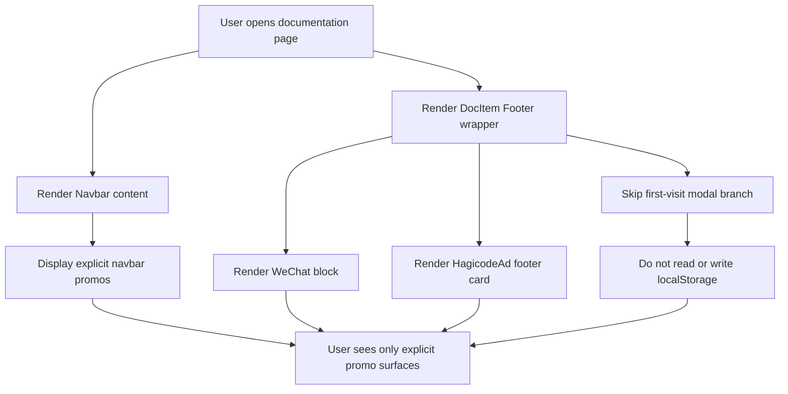
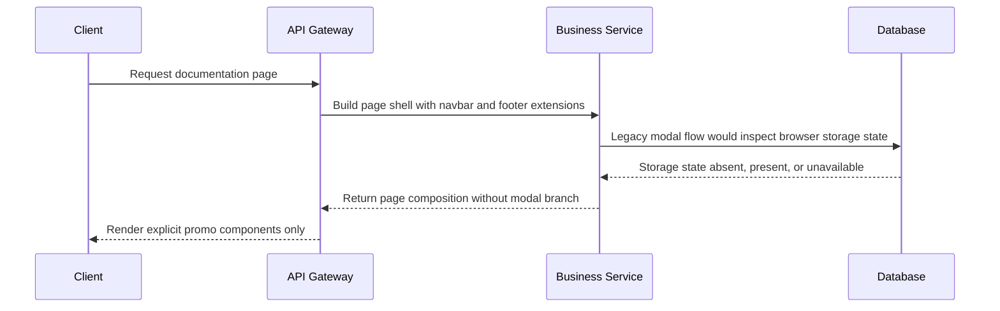

## Context

`repos/newbe` 是一个基于 Docusaurus 的文档站点。当前 HagiCode 推广入口分散在多个位置：

- `src/theme/Navbar/Content/index.js` 中的 `HagicodeAdHeader` 和 `HagicodeAdBanner`，属于显式、可见即所得的推广位；
- `src/theme/DocItem/Footer/index.js` 中的 `HagicodeAd`，同样属于页脚内联广告卡片；
- `src/theme/DocItem/Footer/index.js` 中额外挂载的 `HagicodeModal`，它会在页面首次访问时通过 `shouldShowModal()` 判断是否弹出。

这个弹窗链路由 `src/components/HagicodeConfig.ts` 提供配置与浏览器存储 helper：

- `HAGICODE_CONFIG.modal.storageKey`
- `shouldShowModal()`
- `markTodayVisited()`

`src/components/HagicodeModal/index.tsx` 又额外维护了关闭、焦点约束、ESC 关闭、遮罩关闭和滚动锁定等逻辑。对于“仅做一次首访曝光”的需求来说，这条链路引入了额外运行时状态、`localStorage` 读写和用户阅读打断，但并没有提供站点核心导航或文档消费所必需的能力。

本次变更采用非交互默认假设：

- 现有 CTA 文案、外链目标和其他显式推广位仍然有效，不在本次变更内调整；
- `HagicodeModal` 没有被 Footer 之外的其他运行路径使用，移除 Footer 入口后允许删除该组件及其样式；
- 如果后续仍需要新增推广入口，应优先采用显式 banner/card，而不是重新引入自动弹窗。

## Goals / Non-Goals

**Goals:**

- 移除文档页首次访问时自动展示的 HagiCode 弹窗逻辑与 UI。
- 保留 Footer 和 Navbar 中已经存在的显式 HagiCode 推广位。
- 清理只为首访弹窗存在的浏览器存储 helper 与配置字段，降低运行时分支和维护成本。
- 确保用户在首次访问、回访或浏览器存储不可用时都不会看到自动弹窗。

**Non-Goals:**

- 不调整 `HagicodeAd`、`HagicodeAdHeader`、`HagicodeAdBanner` 的视觉风格、文案或 CTA。
- 不新增新的推广位、埋点系统或后端配置接口。
- 不改造 Docusaurus 文档页的整体布局或 Footer 的其他内容。
- 不在本次变更中处理 HagiCode 推广文案是否需要进一步收敛的问题。

## High-level UI Prototype

```text
Before
┌──────────────────────────────────────────────────────────┐
│ Doc page                                                 │
├──────────────────────────────────────────────────────────┤
│ Navbar promo surfaces (keep)                             │
│ Article content                                          │
│ Footer                                                   │
│ ├─ WeChat follow block                                   │
│ ├─ Hagicode footer ad                                    │
│ └─ Hagicode modal auto-opens on first visit          [×] │
└──────────────────────────────────────────────────────────┘

After
┌──────────────────────────────────────────────────────────┐
│ Doc page                                                 │
├──────────────────────────────────────────────────────────┤
│ Navbar promo surfaces (keep)                             │
│ Article content                                          │
│ Footer                                                   │
│ ├─ WeChat follow block                                   │
│ └─ Hagicode footer ad                                    │
│                                                          │
│ No dialog overlay                                        │
└──────────────────────────────────────────────────────────┘
```

## User Interaction Flow



## Decisions

### Decision: Remove the modal trigger from Footer instead of disabling it behind a flag

在 `src/theme/DocItem/Footer/index.js` 中直接删除 `showModal` 状态、`shouldShowModal()` 检查和 `HagicodeModal` 挂载，而不是保留组件并通过配置将其永久关闭。

- Rationale: 这个入口已经不再需要；保留“永远不打开”的状态机会继续留下无意义的状态管理、effect 和导入。
- Alternative considered: 保留 `HagicodeModal` 组件，只把 `shouldShowModal()` 改成固定返回 `false`。
- Why not chosen: 这样只是把死代码隐藏起来，没有真正减少复杂度，也容易在后续被误接回去。

### Decision: Keep shared product copy in `HAGICODE_CONFIG` and remove only modal-specific config

`HAGICODE_CONFIG` 仍然服务于 `HagicodeAd`、`HagicodeAdHeader`、`HagicodeAdBanner` 等组件，因此保留共享的名称、文案、链接和 CTA；只删除 `modal.storageKey` 与对应 helper。

- Rationale: 共享配置仍然被多个显式推广组件使用，没有必要为了移除弹窗而打散整个配置对象。
- Alternative considered: 把 `HAGICODE_CONFIG` 全量拆分成“modal config”和“ad config”两个独立模块。
- Why not chosen: 超出本次范围，也不会直接增加交付价值。

### Decision: Delete the unused modal component and stylesheet once Footer no longer imports them

当 Footer 不再挂载 `HagicodeModal` 后，直接删除 `src/components/HagicodeModal/index.tsx` 与 `src/components/HagicodeModal/index.module.css`，避免仓库保留一套没有消费者的弹窗实现。

- Rationale: 这组文件只服务于首访弹窗，没有复用点；继续保留会制造“可能仍在使用”的假象。
- Alternative considered: 保留组件文件，等待后续决定是否彻底删除。
- Why not chosen: 项目里已经能通过搜索确认只有 Footer 在使用它，延迟删除只会积累无主代码。

### Decision: Treat browser storage unavailability as a non-event after removal

移除首访逻辑后，不再因为 `localStorage` 不可用打印警告或触发降级弹窗路径；页面应当和普通访问一致。

- Rationale: 浏览器存储只是旧弹窗频控的实现细节，不应该继续影响页面体验或日志噪声。
- Alternative considered: 保留 warning 作为“未来可能重新启用弹窗”的兼容保留。
- Why not chosen: 当前没有任何存储驱动的 promo 行为，保留 warning 没有业务意义。

## Detailed Component Architecture

```text
Documentation Promo Surfaces
├── src/theme/Navbar/Content/index.js
│   ├── HagicodeAdHeader                (keep)
│   └── HagicodeAdBanner                (keep)
├── src/theme/DocItem/Footer/index.js
│   ├── WeChat footer block             (keep)
│   ├── HagicodeAd                      (keep)
│   └── HagicodeModal                   (remove)
├── src/components/HagicodeConfig.ts
│   ├── Shared links / copy / CTA       (keep)
│   └── Modal storage helpers           (remove)
└── src/components/HagicodeModal
    ├── index.tsx                       (delete)
    └── index.module.css                (delete)
```

## Data Flow Diagram



## API Call Sequence Diagram



## Code Change Table

| File Path | Change Type | Change Reason | Impact Scope |
|-----------|-------------|---------------|--------------|
| `src/theme/DocItem/Footer/index.js` | Modify | 移除首访弹窗状态、effect、导入和挂载点 | Footer theme wrapper |
| `src/components/HagicodeConfig.ts` | Modify | 删除 `modal.storageKey`、`shouldShowModal()`、`markTodayVisited()` | Shared promo config |
| `src/components/HagicodeModal/index.tsx` | Delete | 移除未再使用的首访弹窗实现 | User-facing modal UI |
| `src/components/HagicodeModal/index.module.css` | Delete | 清理只服务于弹窗的样式 | Frontend styles |

## Detailed Code Change Inventory

| File Path | Change Type | Change Description | Affected Module |
|-----------|-------------|-------------------|-----------------|
| `src/theme/DocItem/Footer/index.js` | Modify | 删除 `useState` / `useEffect` 的弹窗状态管理，移除 `HagicodeModal`、`shouldShowModal` 导入，保留 `Footer`、微信公众号区块和 `HagicodeAd` | Docusaurus Doc footer |
| `src/components/HagicodeConfig.ts` | Modify | 从配置类型和默认配置中去掉 `modal.storageKey`，删除首访检测与写入 helper，保留 CTA 文案与链接给现有广告组件复用 | Shared HagiCode promo config |
| `src/components/HagicodeModal/index.tsx` | Delete | 删除只由 Footer 触发的弹窗组件、关闭逻辑、焦点锁定和滚动控制 | Modal runtime |
| `src/components/HagicodeModal/index.module.css` | Delete | 删除只被 `HagicodeModal` 使用的样式资源 | Modal styles |

## Risks / Trade-offs

- [误删仍被其他路径依赖的 modal 文件] -> 先通过全仓搜索确认 `HagicodeModal` 仅被 Footer 引用，再删除组件与样式。
- [`HagicodeConfig` 清理过度影响其他推广组件] -> 仅删除 `modal.storageKey` 和首访 helper，保留 CTA、链接、展示文案等共享字段。
- [用户或运营仍期待首访强曝光] -> 在设计中明确保留 Footer 与 Navbar 的显式推广位，避免出现“完全下线 HagiCode 曝光”的误解。
- [删除浏览器存储逻辑后失去未来复用点] -> 如果未来需要新的推广频控，应重新为新需求设计，而不是复活本次移除的死代码。

## Migration Plan

1. 在 `src/theme/DocItem/Footer/index.js` 删除首访弹窗触发链路，保留现有 Footer 内容与 `HagicodeAd`。
2. 清理 `src/components/HagicodeConfig.ts` 中仅用于首访弹窗的配置字段与 helper。
3. 删除 `src/components/HagicodeModal/index.tsx` 和 `src/components/HagicodeModal/index.module.css`。
4. 运行站点构建或类型检查，确认 Footer、Navbar 和现有广告组件仍能正常渲染。
5. 如果需要回滚，只需恢复 Footer 中的 modal 导入与挂载，并还原 `HagicodeConfig` 和 `HagicodeModal` 文件。

## Open Questions

- 当前没有阻塞实现的开放问题。
- 如果后续仍需为新用户提供 HagiCode 引导，是否应改为页内可关闭 banner，而不是再次引入自动模态弹层？
