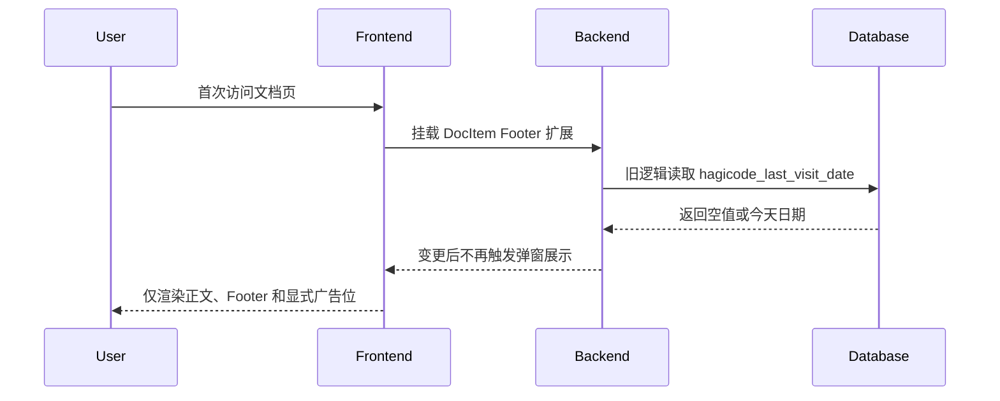

## Why

`repos/newbe` 当前会在文档页首次访问时自动弹出 HagiCode 推广弹窗，这个行为会打断用户直接阅读正文与页脚内容，也让推广入口同时分散在弹窗、页脚广告和其他广告位之间。现在需要移除首访弹窗逻辑和对应 UI，把 HagiCode 的露出收敛为显式、非打断式的推广位，避免继续维护一套基于 `localStorage` 的首访展示路径。

## What Changes

- 移除文档页 Footer 扩展中的首访检测与自动打开 HagiCode 弹窗逻辑。
- 移除 `HagicodeModal` 首访弹窗组件及其样式，不再在文档页首次访问时渲染该弹层。
- 清理 `HagicodeConfig` 中仅服务于首访弹窗的展示频控配置与 `localStorage` 辅助函数。
- 保留现有非打断式 HagiCode 推广位，例如页脚广告卡片与其他显式广告组件，不扩大本次改动范围。
- 采用非交互默认假设：当前仓库中其他 HagiCode 推广组件仍然是有效需求，本次只移除“首次访问自动弹窗”这一入口，不同步调整 CTA 文案、链接目标或其余广告样式。

## Capabilities

### New Capabilities
- `hagicode-promo-surfaces`: 约束 `repos/newbe` 文档页中 HagiCode 推广入口的展示方式，确保推广内容仅通过显式、非自动打断的界面呈现。

### Modified Capabilities
- None.

## Impact

- 受影响代码与内容：
  - `src/theme/DocItem/Footer/index.js`
  - `src/components/HagicodeModal/index.tsx`
  - `src/components/HagicodeModal/index.module.css`
  - `src/components/HagicodeConfig.ts`
- 外部依赖：
  - 浏览器 `localStorage` 读取与写入路径将从首访弹窗逻辑中移除
- 运行影响：
  - 文档页首次访问不再自动弹出 HagiCode 弹层
  - 页脚广告卡片等现有显式推广位继续保留

## High-level UI Prototype

```text
Current footer area
┌──────────────────────────────────────────────────────────┐
│ Article content                                          │
├──────────────────────────────────────────────────────────┤
│ Footer                                                   │
│ 微信公众号推荐                                            │
│ HagiCode 广告卡片                                         │
│                                                          │
│ ┌──────────────────────────────────────────────────────┐ │
│ │ HagiCode 首访弹窗                                [×] │ │
│ │ AI 驱动的代码智能助手                                 │ │
│ │ [安装指南] [实战视频]                                 │ │
│ └──────────────────────────────────────────────────────┘ │
└──────────────────────────────────────────────────────────┘

Target footer area
┌──────────────────────────────────────────────────────────┐
│ Article content                                          │
├──────────────────────────────────────────────────────────┤
│ Footer                                                   │
│ 微信公众号推荐                                            │
│ HagiCode 广告卡片                                         │
│                                                          │
│ (no automatic popup)                                     │
└──────────────────────────────────────────────────────────┘

状态说明: normal=仅展示正文、Footer 与现有广告卡片, hover=广告卡片 CTA 保持现有交互, disabled=无首访检测逻辑, error=浏览器存储不可用也不会触发弹窗
```

## User Interaction Flow



## Code Change Table

| File Path | Change Type | Change Reason | Impact Scope |
|-----------|-------------|---------------|--------------|
| `src/theme/DocItem/Footer/index.js` | Modify | 删除首访检查、弹窗状态与组件挂载 | 文档页 Footer 运行时 |
| `src/components/HagicodeModal/index.tsx` | Remove or stop using | 移除首访推广弹窗 UI 与关闭交互 | 用户可见弹层 |
| `src/components/HagicodeModal/index.module.css` | Remove or stop using | 清理仅供弹窗使用的样式 | 前端样式资源 |
| `src/components/HagicodeConfig.ts` | Modify | 删除弹窗频控配置和 `localStorage` helper，保留其他推广配置 | 共享推广配置 |
