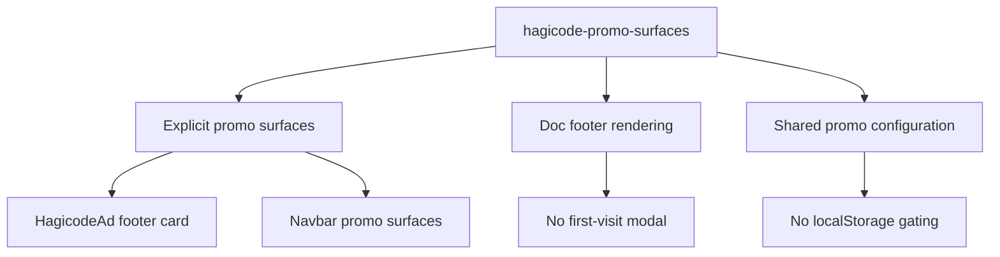

## Capability Model

## Functional Requirements

| Requirement | Summary | Verification Focus |
|-------------|---------|--------------------|
| No automatic first-visit popup | 文档页首次访问不得自动弹出 HagiCode 弹窗 | Footer 渲染行为 |
| Explicit promo surfaces remain | 保留显式推广位，不因移除弹窗而丢失页脚广告或导航广告位 | UI continuity |
| No browser-storage promo gating | 推广展示不再依赖 `localStorage` 首访频控 | Runtime cleanup |

## ADDED Requirements

### Requirement: Documentation pages SHALL NOT display an automatic Hagicode modal on first visit
The system SHALL render documentation pages without automatically opening a HagiCode dialog, including the first page visit in a browser session or on a new day.

#### Scenario: First visit no longer opens a popup
- **WHEN** a user opens a documentation page and no prior HagiCode visit marker exists in browser storage
- **THEN** the page renders article content, footer content, and explicit promo surfaces without opening any HagiCode modal dialog

#### Scenario: Returning visit behaves the same as first visit
- **WHEN** a user revisits a documentation page after previously browsing the site
- **THEN** the page still does not open a HagiCode modal automatically and keeps the reading flow uninterrupted

### Requirement: Documentation promo surfaces SHALL remain explicit and non-blocking
The system SHALL keep explicit HagiCode promotion surfaces, such as the footer ad card and existing navbar promo components, while removing only the automatic first-visit popup surface.

#### Scenario: Footer ad remains visible
- **WHEN** a documentation page footer renders after this change
- **THEN** the footer continues to include the existing explicit HagiCode ad card together with the existing non-HagiCode footer content

#### Scenario: Navbar promo surfaces remain unaffected
- **WHEN** a documentation page renders the navbar content that already includes HagiCode promotional components
- **THEN** those explicit promo components continue to render without depending on the removed modal flow

### Requirement: Hagicode promo configuration SHALL NOT require first-visit browser storage helpers
The system SHALL remove promo behavior that depends on browser storage keys and helper functions dedicated to automatic first-visit HagiCode modal frequency control.

#### Scenario: Browser storage unavailability does not affect page rendering
- **WHEN** browser storage APIs are unavailable or blocked
- **THEN** the documentation page still renders without HagiCode modal warnings, fallback popup behavior, or storage-based promo gating

#### Scenario: Shared config continues serving remaining promo components
- **WHEN** explicit HagiCode promo components read shared links, labels, and feature copy from the shared configuration
- **THEN** they continue to render correctly without any modal-specific storage key or visit-marking helper
